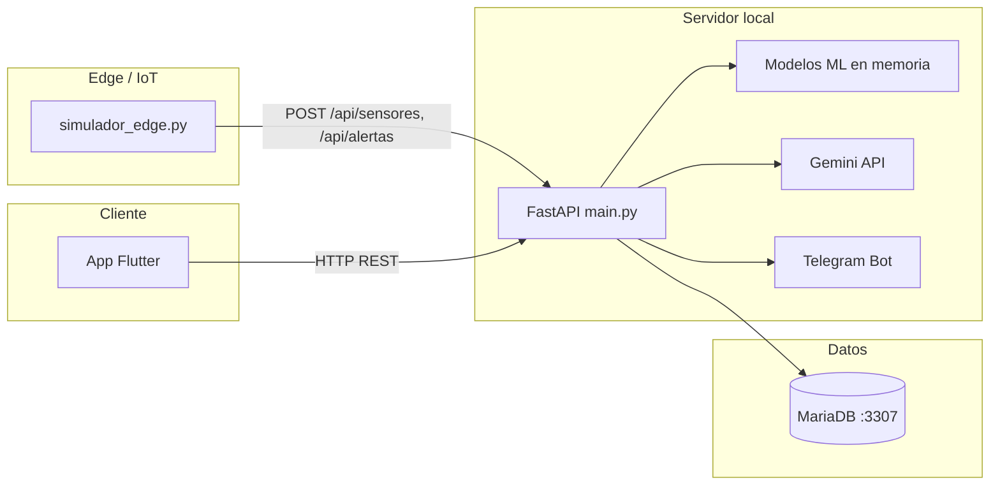

# Predicta — Mantenimiento predictivo industrial (SaaS)

Plataforma B2B de **mantenimiento predictivo** para monitorear maquinaria en tiempo real, detectar anomalías en el borde (edge), predecir vida útil restante (RUL) y alertar al equipo antes de un paro de línea. Incluye dashboard móvil en Flutter, API en FastAPI, base de datos MariaDB y un simulador de nodo IoT.

Desarrollado para **Hackatec**.

---

## Tabla de contenidos

- [Qué hace el sistema](#qué-hace-el-sistema)
- [Arquitectura](#arquitectura)
- [Estructura del repositorio](#estructura-del-repositorio)
- [Requisitos](#requisitos)
- [Configuración paso a paso](#configuración-paso-a-paso)
- [Ejecutar todo el stack](#ejecutar-todo-el-stack)
- [Usuarios de demostración](#usuarios-de-demostración)
- [Flujo de uso recomendado](#flujo-de-uso-recomendado)
- [API REST (referencia rápida)](#api-rest-referencia-rápida)
- [Variables de entorno](#variables-de-entorno)
- [Machine Learning](#machine-learning)
- [Solución de problemas](#solución-de-problemas)
- [Seguridad (importante)](#seguridad-importante)

---

## Qué hace el sistema

| Capa | Responsabilidad |
|------|-----------------|
| **Edge** (`simulador_edge.py`) | Lee sensores simulados, calcula ventanas deslizantes, Isolation Forest local, score de riesgo y envía telemetría/alertas a la API. |
| **Backend** (`main.py`) | Persiste datos, entrena modelos ML en memoria, expone REST, chat con Gemini y notificaciones Telegram. |
| **App Flutter** (`mantenimiento_predictivo/`) | Login multi-rol, gestión de empresas/áreas/máquinas, monitoreo en vivo, gráficas, RUL y chat **Mecanimal**. |
| **Base de datos** (`init.sql` + Docker) | Multi-tenant: empresas → áreas → máquinas → telemetría y alertas. |

**Sensores monitoreados:** temperatura, vibración, voltaje, velocidad (RPM), humedad.

**Roles:**

| Rol | Permisos |
|-----|----------|
| `instalador` | Crear empresas, áreas y vincular hardware (máquinas). |
| `jefe` | Configurar umbrales de alerta/peligro, áreas, participantes. |
| `participante` | Solo lectura del dashboard y chat con la IA. |

---

## Arquitectura



**Puertos por defecto**

| Servicio | Puerto |
|----------|--------|
| API FastAPI | `8000` |
| MariaDB (host) | `3307` → contenedor `3306` |

---

## Estructura del repositorio

```
hack/
├── main.py                 # API FastAPI + ML servidor + Gemini + Telegram
├── simulador_edge.py       # Nodo edge simulado (envía datos de M-01)
├── init.sql                # Esquema y datos seed de la BD
├── docker-compose.yml      # MariaDB 10.11 con init automático
├── .env                    # Credenciales (lo creas tú; no va al repo)
├── script.sh               # Prototipo antiguo de edge (no usar en producción)
└── mantenimiento_predictivo/
    ├── .env                # URL del backend para la app Flutter (local)
    ├── .env.example        # Plantilla para configurar API_BASE_URL
    └── lib/
        ├── main.dart           # Login, empresas, áreas, máquinas
        ├── pantalla_monitoreo.dart
        └── chat_mecanimal.dart
```

---

## Requisitos

### Software

- **Docker Desktop** (o Docker + Docker Compose) — para MariaDB
- **Python 3.9+**
- **Flutter SDK** estable (Dart ^3.10 según `pubspec.yaml`)
- Editor/IDE (VS Code, Android Studio, etc.)

### Cuentas / claves (opcionales pero recomendadas)

| Variable | Uso |
|----------|-----|
| `GEMINI_API_KEY` | Diagnósticos en edge, chat Mecanimal y alertas con IA |
| `TELEGRAM_BOT_TOKEN` + `TELEGRAM_CHAT_ID` | Push de alertas críticas al móvil/Telegram |

Sin Gemini, el sistema sigue funcionando con mensajes de respaldo. Sin Telegram, simplemente no se envían notificaciones externas.

### Dispositivo para la app

- **Emulador Android:** la API debe ser alcanzable desde el emulador (`10.0.2.2` apunta al `localhost` de tu PC).
- **Teléfono físico:** PC y teléfono en la **misma red Wi‑Fi**; la app debe apuntar a la **IP LAN de tu PC**, no a `localhost`.

---

## Configuración paso a paso

### 1. Clonar e ir a la raíz del proyecto

```bash
cd ruta/al/hack
```

### 2. Base de datos con Docker

```bash
docker compose up -d
```

Esto levanta MariaDB en el puerto **3307** y ejecuta `init.sql` la primera vez (crea tablas, empresa demo y máquina `M-01`).

Comprobar que el contenedor está arriba:

```bash
docker compose ps
```

**Credenciales de BD** (ya usadas en `main.py`):

| Campo | Valor |
|-------|-------|
| Host | `127.0.0.1` |
| Puerto | `3307` |
| Base de datos | `mecanimales_db` |
| Usuario | `api_user` |
| Contraseña | `api_password_seguro` |

> Si cambias credenciales en `docker-compose.yml`, actualiza también la función `conectar_db()` en `main.py`.

**Reiniciar BD desde cero** (borra datos):

```bash
docker compose down -v
docker compose up -d
```

### 3. Entorno Python

Crear entorno virtual (recomendado):

```bash
python -m venv venv

# Windows (PowerShell)
.\venv\Scripts\Activate.ps1

# macOS / Linux
source venv/bin/activate
```

Instalar dependencias:

```bash
pip install -r requirements.txt
```

### 4. Archivo `.env` en la raíz (junto a `main.py`)

Crea `.env` con:

```env
GEMINI_API_KEY=tu_clave_de_google_ai_studio
TELEGRAM_BOT_TOKEN=
TELEGRAM_CHAT_ID=
```

Obtener clave Gemini: [Google AI Studio](https://aistudio.google.com/).

**Telegram (opcional):**

1. Habla con [@BotFather](https://t.me/BotFather) y crea un bot → copia el token.
2. Obtén tu `chat_id` (por ejemplo con [@userinfobot](https://t.me/userinfobot) o enviando un mensaje al bot y consultando la API `getUpdates`).

### 5. Configurar la URL del API en Flutter (obligatorio)

Ahora la URL base de la app se define en **un solo lugar**:

- `mantenimiento_predictivo/.env`

Contenido mínimo:

```env
API_BASE_URL=http://10.0.2.2:8000
```

También tienes una plantilla en `mantenimiento_predictivo/.env.example`.

**Ejemplos de URL base:**

| Escenario | URL base sugerida |
|-----------|-------------------|
| Emulador Android en la misma PC | `http://10.0.2.2:8000` |
| iOS Simulator en Mac | `http://127.0.0.1:8000` |
| Teléfono físico (misma Wi‑Fi) | `http://TU_IP_LAN:8000` (ej. `http://192.168.1.42:8000`) |
| Flutter Web en la misma PC | `http://127.0.0.1:8000` |

En Windows, averigua tu IP LAN:

```powershell
ipconfig
```

Busca **IPv4** de tu adaptador Wi‑Fi o Ethernet y colócala en `API_BASE_URL`.

> El simulador edge (`simulador_edge.py`) usa `http://127.0.0.1:8000` — correcto si API y edge corren en la misma máquina.

### 6. Dependencias Flutter

```bash
cd mantenimiento_predictivo
flutter pub get
cd ..
```

---

## Ejecutar todo el stack

Abre **cuatro terminales** (o tres si no usas Telegram/Gemini de inmediato).

### Terminal 1 — Base de datos

```bash
docker compose up -d
```

### Terminal 2 — API (escuchar en todas las interfaces)

Desde la raíz del repo, con el venv activado:

```bash
uvicorn main:app --reload --host 0.0.0.0 --port 8000
```

- Documentación interactiva: [http://127.0.0.1:8000/docs](http://127.0.0.1:8000/docs)
- Estado de modelos ML: `GET http://127.0.0.1:8000/api/ml/estado`

`--host 0.0.0.0` es necesario para que el teléfono o el emulador puedan conectarse.

### Terminal 3 — Simulador edge (telemetría en vivo)

```bash
python simulador_edge.py
```

Simula **40 ciclos** (~80 s) para la máquina **`M-01`**, con fases:

1. Ciclos 1–10: operación normal  
2. 11–18: degradación (alerta predictiva)  
3. 19–28: condición crítica  
4. 29+: vuelta a normal  

Envía datos a `/api/sensores` y alertas a `/api/alertas` cuando el score de riesgo lo amerita.

### Terminal 4 — App Flutter

```bash
cd mantenimiento_predictivo
flutter devices
flutter run
```

Elige emulador o dispositivo conectado por USB.

---

## Usuarios de demostración

Definidos en `init.sql` (contraseñas en texto plano solo para desarrollo):

| Email | Contraseña | Rol | Empresa |
|-------|------------|-----|---------|
| `admin@predicta.com` | `root` | instalador | Predicta Core |
| `jefe@predicta.com` | `hackatec2026` | jefe | Planta Ensambladora Alpha |
| `tecnico@predicta.com` | `1234` | participante | Planta Ensambladora Alpha |

**Máquina precargada:** `M-01` — *Motor Principal* (área *Línea de Motores*).

Para ver datos en el dashboard sin el simulador, necesitas al menos lecturas en `SensorData`; el edge las genera automáticamente.

---

## Flujo de uso recomendado

1. Levantar Docker + API + (opcional) simulador edge.  
2. Iniciar la app Flutter con la URL del API ya corregida.  
3. Iniciar sesión como **`jefe@predicta.com`** / `hackatec2026`.  
4. Entrar en **Línea de Motores** → **Motor Principal (M-01)**.  
5. En la pantalla de monitoreo verás gauges, gráficas (Syncfusion), estado, RUL y alertas.  
6. Abre el chat **Mecanimal** y pregunta por el estado de la máquina.  
7. Con el simulador corriendo, observa transiciones `optimo` → `alerta` → `peligro` y notificaciones en pantalla.  
8. Como **instalador** (`admin@predicta.com`), crea empresas, áreas y vincula nuevas máquinas con ID tipo `M-05`.

---

## API REST (referencia rápida)

| Método | Ruta | Descripción |
|--------|------|-------------|
| `POST` | `/api/login` | Autenticación |
| `POST` | `/api/usuarios` | Registrar usuario |
| `POST` | `/api/sensores` | Telemetría desde edge |
| `POST` | `/api/alertas` | Registrar alerta (+ Telegram si configurado) |
| `GET` | `/api/maquinas/{id}/datos` | Estado + historial (50 lecturas) |
| `GET` | `/api/maquinas/{id}/prediccion` | RUL y texto predictivo |
| `GET` / `PUT` | `/api/maquinas/{id}/config` | Umbrales y sensores activos |
| `GET` | `/api/empresas` | Listado empresas |
| `GET` | `/api/empresas/{id}/areas` | Áreas por empresa |
| `GET` | `/api/areas/{id}/maquinas` | Máquinas por área |
| `POST` | `/api/maquinas` | Registrar máquina |
| `POST` | `/api/areas` | Crear área |
| `POST` | `/api/empresas_rapido?nombre=` | Crear empresa |
| `POST` | `/api/chat` | Chat Mecanimal (Gemini) |
| `GET` | `/api/ml/estado` | Debug: modelos cargados en RAM |

Ejemplo de login:

```bash
curl -X POST http://127.0.0.1:8000/api/login ^
  -H "Content-Type: application/json" ^
  -d "{\"email\":\"jefe@predicta.com\",\"password\":\"hackatec2026\"}"
```

*(En PowerShell puedes usar `Invoke-RestMethod` o curl con comillas simples en Linux/macOS.)*

---

## Variables de entorno

| Variable | Archivo | Requerida |
|----------|---------|-----------|
| `GEMINI_API_KEY` | `.env` | No (hay fallback sin IA) |
| `TELEGRAM_BOT_TOKEN` | `.env` | No |
| `TELEGRAM_CHAT_ID` | `.env` | No |
| `API_BASE_URL` | `mantenimiento_predictivo/.env` | Sí (para la app Flutter) |

La conexión MySQL **no** usa variables de entorno; está en `conectar_db()` dentro de `main.py`.

---

## Machine Learning

### En el servidor (`main.py`)

Tras acumular datos, se re-entrenan cada **10** nuevas lecturas por máquina:

- **Logistic Regression** (+ scaler): estado `optimo` / `alerta` / `peligro`
- **Gradient Boosting** (cuantiles): predicción de temperatura y RUL con intervalo
- **Isolation Forest**: detección de anomalías multivariadas

RUL visible en la app cuando hay **≥ 15** muestras (`GET .../prediccion`).

### En el edge (`simulador_edge.py`)

- Ventana deslizante de 10 lecturas (media, desviación, delta)
- **Isolation Forest** local (desde 15 muestras, re-entrena cada 5)
- **Score de riesgo** 0–100 → alertas predictivas (≥ 35) o críticas (≥ 70)
- Diagnósticos generados con Gemini antes de `POST /api/alertas`

---

## Solución de problemas

| Síntoma | Qué revisar |
|---------|-------------|
| App: "Error de conexión con el servidor" | API corriendo con `--host 0.0.0.0`; valor correcto en `mantenimiento_predictivo/.env`; firewall de Windows permite puerto 8000 |
| Emulador no llega a `127.0.0.1` | Usar `10.0.2.2:8000` en la app, no `127.0.0.1` |
| `mysql.connector` error / connection refused | `docker compose ps`; puerto 3307 libre; esperar ~10 s tras el primer `up` |
| Simulador edge sin efecto en la app | Misma máquina `M-01`; API activa; login en empresa que contiene esa máquina |
| RUL dice "Insuficientes datos" | Dejar correr el simulador o edge hasta ≥ 15 lecturas |
| Gemini no responde | `GEMINI_API_KEY` válida en `.env`; reiniciar uvicorn tras cambiar `.env` |
| Telegram no notifica | Token y chat_id correctos; el bot debe poder escribir al chat |
| Tablas vacías tras cambios en SQL | `docker compose down -v` y volver a subir |
| CORS | Ya permitido `*` en la API para desarrollo local |

**Comprobar API y BD:**

```bash
curl http://127.0.0.1:8000/api/ml/estado
curl http://127.0.0.1:8000/api/empresas
```

---

## Seguridad (importante)

- Las contraseñas del seed están en **texto plano** solo para el hackathon; en producción usar **bcrypt** y JWT.
- No subas `.env` ni claves a Git. El archivo `script.sh` es un prototipo antiguo con una API key embebida: **no lo uses**; usa `simulador_edge.py` + `.env`.
- Restringe CORS y `allow_origins` antes de desplegar en internet.
- Cambia las contraseñas por defecto de MariaDB en `docker-compose.yml` para entornos compartidos.

---

## Stack tecnológico

| Componente | Tecnología |
|------------|------------|
| Backend | Python, FastAPI, Uvicorn, scikit-learn, google-generativeai |
| Base de datos | MariaDB 10.11 (Docker) |
| Edge | Python, NumPy, scikit-learn, requests |
| Frontend | Flutter, http, Syncfusion Charts & Gauges |
| IA | Google Gemini 2.5 Flash |
| Alertas | Telegram Bot API |


